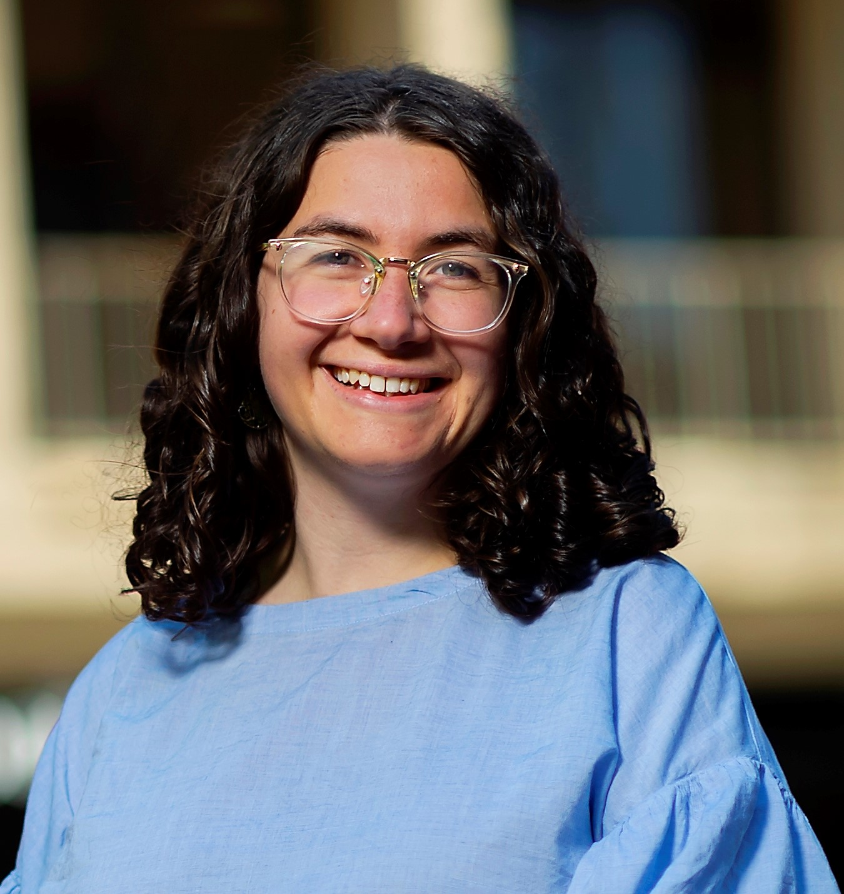

This is about our project with ITU.

Who are we?

- {: style="height:60px;width:60px"} Tova Perlman   
Tova hails from Philadelphia, PA. She graduated in May 2021 with a degree in Urban Spatial Analytics from the University of Pennsylvania and is looking forward to pursuing a career in geospatial data science. The highlight of her summer was meeting new colleagues located internationally and learning how to use geemap API for python. 

- Utku Can Ozturk
- Jonathan Cook
- Jacob Beck
{: style="height:60px;width:60px"}

Project Mentor:
Daniel Townsend

Technical Mentor: 
Robert Hager

Who is ITU?

ITU mission is to facilitate connecting all the world's people and to protect and support everyone's right to communicate. ITU and UNICEF have joined forces in the Giga initiative in a bid to connect every school to the Internet by 2030. Aside from directly benefitting children, schools often act as community hubs and so connecting a school often connects the surrounding community too. 

Who is UNICEF?

What is Project Giga?
