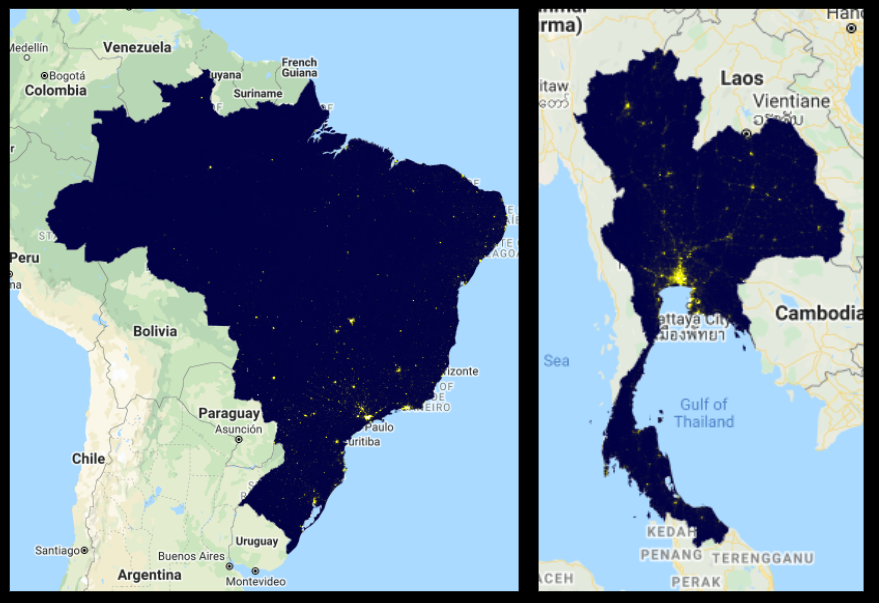
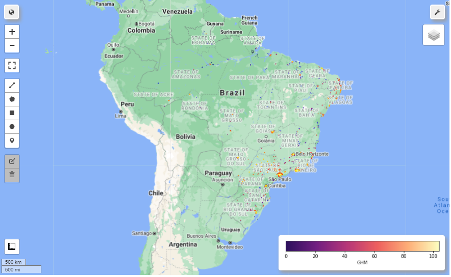
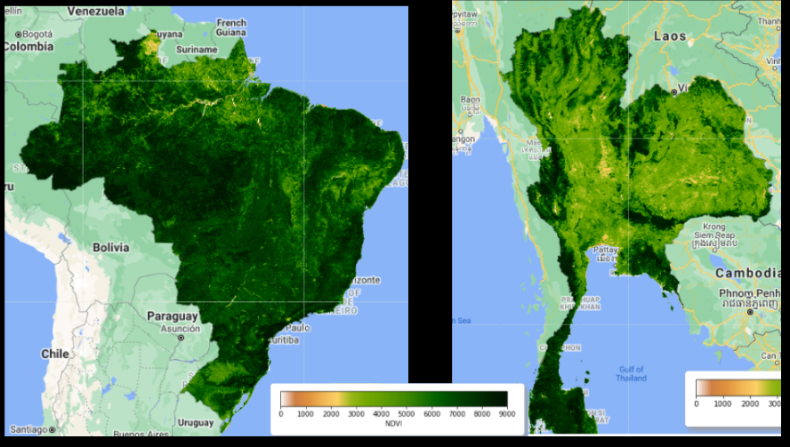
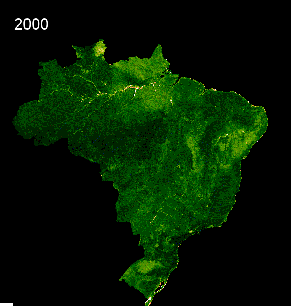

The first thing we wanted to explore in our Exploratory Data Analysis was some maps of what our countries looked like and how our predictors might map onto our countries. We used Google Earth Engine to create some maps of nighttime imagery, the global human modification index and the vegetation index. For nighttime and vegetation index, we also wanted to show the change in time as we were using the rate of change as a predictor as well. Below you will find some static images of the maps we created. If you click on them, you can also find an interactive version. 

Satellite Images on a National Level for both Brazil and Thailand:

1. Average Radiance Band
Here we see that the Average light comes from the big cities in the south for both countries. This predictor later plays a big role in determining internet connectivity.

Click on this [map](Images/avg_rad_schools.html) to see a comparison between school points average radiance in 2014 and in 2019. 

2. Cloud Free Band
This is a second band within the VIIRS Satellite nighttime images. It measures light without clouds or solar illumination. In some ways, specifically in tropical rainforests which both Brazil and Thailand have, it is a better measure of light emittance than the average radiance band. We use both as predictors in our model. Additionally, you see in the maps that the light emittance looks vastly different.  

3. [Global Human Modification Map](Images/ghm_map.html)

In this map, we see the level of Global Human Modification in the last few years within both Brazil and Thailand. For more information on how this dataset was compiled, please see the Data Gathering page. 

Here you can also examine the entire country:
[Brazil Map](Images/Brazil_GHM.html)

4. Normalized Difference Vegetation Index
Here we see the difference in vegetation between Brazil and Thailand. [Click here](Images/NDVI_Brazil.html) to see the map for Brazil, toggle between the layers to see the entire country and just the school point areas. 

Now we can show we buffer it for a specific area:

We will subset to a specific admininstrative area or to a buffer area?

5. Show split map depicting nighttime rate of change

6. Map depicting NDVI change

Here we also see a GIF that shows the time series change of Vegetation from 2000 to 2021. 

6. Show graphs for monthly mean radiance of a specific area?

Speedtest data

Cell data

Facebook Data?

What do our predictors look like and how do they compare?

Show the buffer zones for schools 

Put automatic EDA script that Utku worked on- are we sharing screenshots or actual code?
