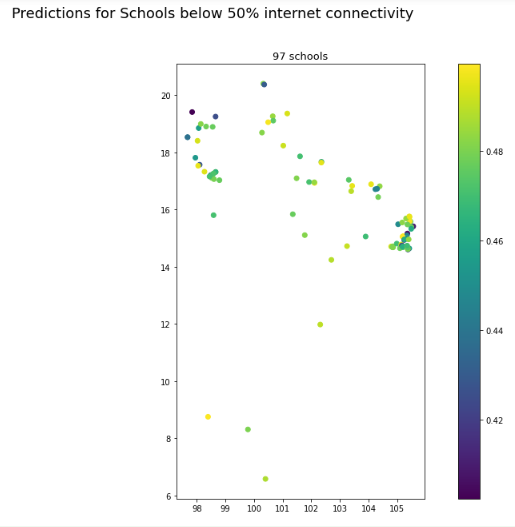
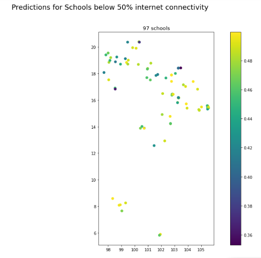

# Model Application

This is where we show our application of our Brazil model to the Thailand Data and display how well it did.

Our next big step was applying the best model to Thailand data. We were nervous to apply the model as we were not sure that the same assumptions that are true for Brazil would hold true for Thailand. While the satellite data and ground may look the same, the national level economic and political indicators were not accounted for in the model.

We load the model from mlflow where it was pickled as an artifact. Here's some code showing how it was reloaded.

We then input the thailand school points as well as all of the same predictors into the model to be predicted. 

Here are the maps show the schools prediction from 0-100 in Thailand.

These are all the schools in Thailand, as one can tell it looks pretty good

Here are the schoools just below 50% internet connectivity, prediced by the best Random Forest Model. There are 97 schools predicted.

Here are the schoools just below 50% internet connectivity, prediced by the best XGBoost Model. There are 97 schools predicted. It has a slightly different pattern from Random Forest but not completely.

Then we aggregated up to a province level as we only have the survey data on that level. This proved challenging for a number of reasons. For one, the level of granularity for the school level is very overshadowed when aggregated to a province level, as there are only 77 provinces within Thailand. It is an unhelpful ground truth to evaluate our predictions which are on a school level. It is therefore hard to know if we can trust our predictions for the schools. 

Here is what our model prediction look like compared to ground truth, as you can tell they are very different from each other:
