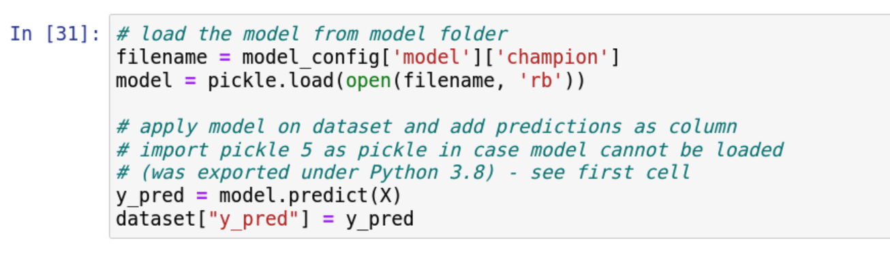
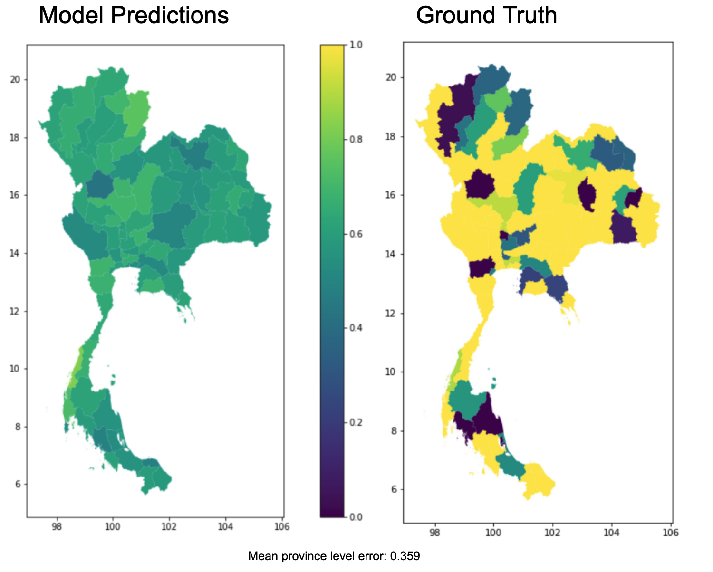

# Model Application

## Thailand

Our next big step was applying the best model to Thailand data. We were curious to apply the model as we were not sure that the same assumptions that are true for Brazil would hold true for Thailand. While the satellite data and vegetation may look the same, the national level economic and political indicators were not accounted for in the model. This is because, due to the project scope and capacity, we did not train multiple different national models. Had we had more time and data, perhaps this would have been an alternative route and we could have included some of this information. Instead, we trained a model exclusively on Brazil. For more discussion on future multi-national models, please see the conclusion. Therefore, the limitations for our model rooted in basic assumptions that local areas can be comparable.

Our second set of limitations was in the nature of the Thailand data. We wanted to predict and evaluate the Thai schools in the same manner that we did for the Brazil schools. However, the survey data that served as ground truth for Brazil was on an enumeration area level while the survey data for Thailand was on a province area level (of which there are 77 in Thailand). These area units are not comparable and therefore made the evaluation for Thailand more complicated. Below you can see our predictions on a school level which look generally good, though there is no ground truth by which to evaluate. We then scale these school predictions up to a province level. When we get to the province level evaluation, our predictions look much worse. This perhaps can reflect upon our model and its questionable performance, but it also reflects on the raw survey data itself as we are skeptical of the amount of provinces that have 100% internet connectivity to begin with. 

Steps in our model application to new data. Please click here for a complete predict.py script.
[Click here](scripts/Thailand Predictions_ XGBoost_Model.ipynb) for a Jupyter notebook with the XGBoost Predictions and [its html](scripts/Thailand Predictions_ XGBoost_Model.html) equivalent. 

2. Using the model_config, we load the Thailand data with the school points and the same predictors used by the original model.

1. Then, we load the model from mlflow where it was pickled as an artifact. Here's some code showing how it was reloaded.

3. Then we examine the predictions on a map: 
Here are the maps that show the schools' predictions from 0-1 in Thailand.

These are all the schools in Thailand, as one can tell it looks reasonable.

Here are the schoools just below 50% internet connectivity, predicted by the best Random Forest Model and the best XGBoost Model. There are 97 schools predicted in both, but slightly different pattern of schools.

In order to compare our predictions to the ground truth, we aggregated the schools up to a province level as we only have the survey data on that level. This proved challenging for a number of reasons as stated above. 

Here is what our model prediction look like compared to ground truth, as you can tell they are very different from each other:

While our mean province level error is .35, which is not terrible, we can see that the model predictions on a province level diverge greatly from the existing ground truth. Therefore, we are uncertain about the ability for our Brazil model to accurately predict schools with low internet connectivity in Thailand.

## Philippines
We also were able to test this out on the Philippines. The Philippines had better data as their surveys were on an enumeration area level. Here are the results from our Philippines predictions. 

## School Priorization
Building on our school area predictions and additional information such as population or potentially school internet connectivity we are capable of creating a priotitizing list of schools. This priorization can be done according to various indicators such as relative offline population, absolute offline population. Furthermore, if the data contains the respective information, the priorization can be customized additionally, e.g. narrowed down to a federal state or to schools in rural areas.

As a first step the feature-engineered training dataset for the respective country (in the following example: Brazil) and the pickled champion model are loaded. 
The imported model is then applied and predicts online population for the schools featured in the dataset. 
Additionaly, absolute population data and school data are loaded and merged for additional information. While population data is necessary to calculate the absolute offline population around a school, additional school information such as internet availability or pupil count might not be at hand. Nevertheless, those are just optional further specifications and are not required for priorization. 

Since our predicting model was not restricted to predict only values between 0 and 1 we first adjust all predicted values into the boundaries 0 to 1. 
After that, the prediction of online population share is multiplied with the respective population count, which yields the estimated absolute onine population around a school. The corresponding offline population is calculated by taking 1- "online population share" and multiplying this value with the population. 
At this point, the arithmetical steps are already all done and a custom priorization list can be generated. In this example we first export the list of schools sorted descendingly by absolute offline population. In theory, connecting the first school in this list would potentially benefit the largest number of individuals in the school sample. We export additional information provided in the school data such as the school's name to facilitate use of the list.
As our exemplary data for Brazil contains additional information (e.g. computer and internet availability) we do not only add these variables to our exported file, but we also subset our schools to prioritize using these. It makes sense to exclude schools that, according to the UNICEF school data, already have internet access. Therefore, the second file lists only the offline schools ranked by the absolute offline population around it. 
The third subsetting step, was to exclude the 10th population number decile of the sample, i.e. the outlying 10% of schools, that have the largest number of population around them. This rather exploratory step was done to investigate, whether some schools are highly prioritized solely due to their high population numbers. Excluding the highest populated areas (in most cases large metropolitan areas) can lead towards the potentially less obvious hubs of offline population. 
For each of the priorization lists a graphic that maps the schools and depicts the offline population can be provided. 

## Country-level Aggregation 
A furher step of model application was the aggregation to the country level. However, estimating the mere average of online population shares is not possible in this case, since it would weight each enumeration area (or other unit of geographic aggregation) equally. An enumeration area with 25 inhabitants would contribute as much to the national average as an enumeration area with 25.000 people. 
Therefore, the national average is calculated slightly different. We sum up the previously calculated absolute online population and sum up the total population in our sample. If our enumeration area sample is representative for the whole country, dividing the total online population by the total population (both in sample) would yield a representative national level connectivity share. Ultimately, this proportion can be multiplied with the national population in order to get the absolute number of people connected to the internet. As a robustness check, the same calculations are then conducted using the ground truth connectivity data. 
If the required data is available the aggregation can of course also be done to a province, federal state or other geographical level. 

### Population data remarks
Generally, some remarks regarding the absolute population data should be made and considered by users. For the priorization and the country level aggregation, the absolute number have to be treated cautiosly due to school area overlap. In this exemplary priorization list we can see that the first X schools have the same ground truth connectivtity level. THis indicated, that thsoe schools are all located in the same enumeration area. THerefore, the 1km radius school areas are most likely going to overlap and individuals within this overlap are counted more than once in the population numbers. Nevertheless, the number of around 50.000 people potentially reached with connecting the one specific school still holds true. It is just importan to bear in mind, that connecting 5 schools with potentially 50.000 people reached does not connect 250.000 people to the internet, due to the population overlap of the schools.
Correspondingly, once the first school is connected the priorization might be altered, since some individuals could already by affected by that, i.e. using the connected school's internet. 
Furthermore, due to the overlap of school areas adding up the poopulation numbers of the enumeration areas will always overestimate the total number of indiviudals featured in our analysis, as many will be counted more than once. It therefore prevents to clearly make out how many individuals are included in the model. 
If researchers and organizations are aware of this and treat the population data cautiosly, it can still be used as a fruitful resource. Even though, densely populated areas like Sao Paolo will have school area (and therefore population data) overlap, the model is able to detect this enumeration area/neighborhood as an area that would profit largely from being connected. Moreover,providing one school with internet access in a densely populated area will in any case most likely not suffice to provide multiple thousands of people with internet. Hence, it seems to be a reasonable suggestion made by the model to connect multiple or even all of the respective schools to the internet.