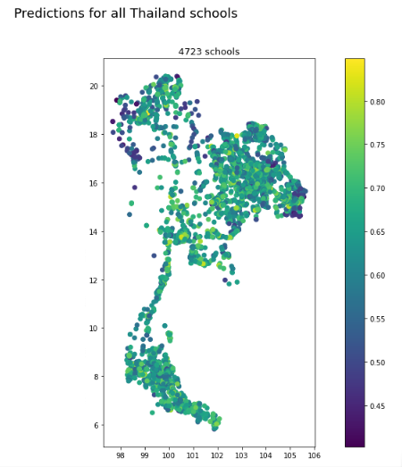

# Model Application

## Thailand

Our next big step was applying the best model to Thailand data. We were curious to apply the model as we were not sure that the same assumptions that are true for Brazil would hold true for Thailand. While the satellite data and vegetation may look the same, the national level economic and political indicators were not accounted for in the model. This is because, due to the project scope and capacity, we did not train multiple different national models. Had we had more time and data, perhaps this would have been an alternative route and we could have included some of this information. Instead, we trained a model exclusively on Brazil. For more discussion on future multi-national models, please see the conclusion. Therefore, the limitations for our model rooted in basic assumptions that local areas can be comparable.

Our second set of limitations was in the nature of the Thailand data. We wanted to predict and evaluate the Thai schools in the same manner that we did for the Brazil schools. However, the survey data that served as ground truth for Brazil was on an enumeration area level while the survey data for Thailand was on a province area level (of which there are 77 in Thailand). These area units are not comparable and therefore made the evaluation for Thailand more complicated. Below you can see our predictions on a school level which look generally good, though there is no ground truth by which to evaluate. We then scale these school predictions up to a province level. When we get to the province level evaluation, our predictions look much worse. This perhaps can reflect upon our model and its questionable performance, but it also reflects on the raw survey data itself as we are skeptical of the amount of provinces that have 100% internet connectivity to begin with. 

Steps in our model application to new data. Please click here for a complete predict.py script: 

2. Using the model_config, we load the Thailand data with the school points and the same predictors used by the original model.

1. Then, we load the model from mlflow where it was pickled as an artifact. Here's some code showing how it was reloaded.

3. Then we examine the predictions on a map: 
Here are the maps that show the schools' predictions from 0-1 in Thailand.

These are all the schools in Thailand, as one can tell it looks pretty good

Here are the schoools just below 50% internet connectivity, predicted by the best Random Forest Model and the best XGBoost Model. There are 97 schools predicted in both, but slightly different pattern of schools.

In order to compare our predictions to the ground truth, we aggregated the schools up to a province level as we only have the survey data on that level. This proved challenging for a number of reasons as stated above. 

Here is what our model prediction look like compared to ground truth, as you can tell they are very different from each other:

While our mean province level error is .35, which is not terrible, we can see that the model predictions on a province level diverge greatly from the existing ground truth. Therefore, we are uncertain about the ability for our Brazil model to accurately predict schools with low internet connectivity in Thailand.

## Philippines
We also were able to test this out on the Philippines. The Philippines had better data as their surveys were on an enumeration area level. Here are the results from our Philippines predictions. 