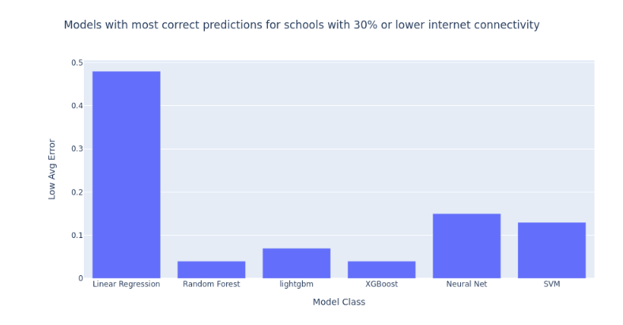
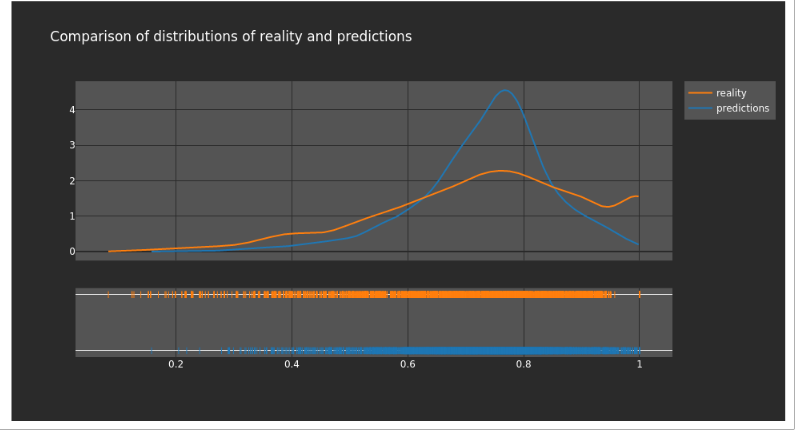

# Modeling Section:

The model we need to train is a regression model as we are attempting to predict a number between 0 and 1 of internet connectivity. A result or prediction of 0 means that of the households surveyed (about 11), no households in the enumeration area stated that they had access to internet. A result or prediction of 1 means that every household surveyed in the enumeration area had access to internet. Most responses fell on a scale between 0 and 1, indicating that some but not all families had internet access. Later on, we attempted to turn this into a classification problem to check our work but it did not provide any higher accuracy. 

## Training Set EDA
We also did some Exploratory Data Analysis once our training dataset was created. [Click Here](scripts/testing.html) for the full notebook of explanatory visualizations. [Click here](scripts/testing.ipynb) for the Jupyter Notebook .ipynb file. 

## Mlflow Set-up (Optional)

In order to track our models, we set up autologging in mlflow. [Mlflow](https://www.mlflow.org/docs/latest/index.html) is an exciting and experimental way of logging models. We set up our model training so that our python script for each model would create a new experiment for each run, it would log each of our model parameters when we did hyperparameter tuning and then log the best parameter at the top. In this way we were able to compare the various parameters logged in each run to determine how to change the grid space of the hyperparameters. We also were then able to compare models to each other. Within mlflow, we also logged the predictors for each run and the requirements for packages and dependencies to run. Each run also logs the best model as an artifact, so one can easily take the model and apply it to new data. We are including both the best model logged, as well as each run, here in order to make this as reproducible as possible. Below you can see a screenshot of a mlflow which logs our best runs, with our best hyperparameters and using our custom metric for evaluation.  On the side, you can also see the list of other experiments we ran with different models. 
    

        ``` #### mlflow setup ####

        # save runs
        mlflow.set_tracking_uri("file:///files/mlruns")
        mlflow.tracking.get_tracking_uri()

        #Naming the set_experiment
        dt = date.today().strftime('%d/%m/%Y')
        experiment_name = dt + model_config['meta']['experiment_name']
        mlflow.set_experiment(experiment_name)
        mlflow_client = mlflow.tracking.MlflowClient()
        experiment_id = mlflow_client.get_experiment_by_name(experiment_name).experiment_id ```

Here you can see the simplicity of reload the model artifact later on and applying on new data:
    


## Model Configuration
Once we have mlflow set up and our model_config.yaml file set up, we can run many different experiments using our .py scripts by changing a few things within our yaml file. [Click here](scripts/model_config.yaml) to see the full yaml file. Below you can also see how it was set up. We use this to steer our scripts and set our parameters. We set up the input data at the top which is our training data, then label the target and predictor variables as well as the name of the experiment and a brief description in run_name. Under the parameters section, we set parameters like test size (which is crucial), the amount of cross validation folds to do, the number of iterations and the threshold for our custom metric. The threshold tells the model which percent of schools with low internet connectivity to focus on. Then within parameters, there are different sections based on what type of model you might decide to run. Our .yaml file contains parameters for grid search within Random Forest, LightGBM and XGBoost.


## Model Training

We tried out 7 different model classes and ran over 100 experiments each containing 20 or more runs that tried various parameters in order to determine which model had the best accuracy. We experimented with various parameters, as well as different combinations of predictors. Below is the final list of predictors we used and a heat map displaying their collinearity. As you can see, there is not high multi-collinearity among our predictors except with the mean global human modification and the mean average radiance. However, we felt both predictors were important and had high feature importance in the model so we decided to keep both in. 
    

In this figure, one can see the correlation between predictors and our target variable. Predictors like the global human modification and average radiance have strong correlation. 


Another way that we improved accuracy was by building a custom metric in order to score both our test set within our cross validation and our final holdout set. The metric calculates errors specifically by taking the prediction below .3 (or another threshold, we also experimented with .5) subtracting that from the ground truth below .3 (or another threshold), taking the absolute value and then returning the average of all those errors. Below please find a code snippet of our custom metric.

        #Create custom scoring
            def custom_eval_metric(y_true, y_pred):
            errors_low = abs(y_pred[y_pred<0.3] - np.asarray(y_true[y_pred<0.3]).flatten())
            return np.mean(errors_low)

        custom_scorer = make_scorer(custom_eval_metric, greater_is_better = False)

        # define grid search
        search = GridSearchCV(model, parameters, scoring = custom_scorer, cv = inner_cv ,
                                    refit=True,
                                    verbose = 2)

 We built this as we understood that it was more important to have better accuracy on schools with lower internet connectivity than higher connectivity. Before insitituting the custom metric, our models were good with predicting the average values, but they did poorly at either end of the spectrum and particularly on the low values. In order to remedy this issue, we first dropped any rows that had an internet connectivity of zero (there were 23 of them). We dropped the zero's because our project partners informed us that they were most likely due to incomplete data and because they skewed our results. Because there were only 23 of them, we felt it did not impact the data class balancing. Secondly, we instituted our custom metric which trained the model to minimize the error score under the .3 level of prediction. 
 
 The resulting champion out of over 2000 models was XGBoost with an average error of .06 and specifically for under the .3 threshold, had an average error of .05. This means that for schools that are predicted to be below 30%, we can trust the model's predictions, as on average the predictions are only off by 5 percentage points from the ground truth value. 

 Below, you can see the list of all the model classes we tried. Feel free to try out running these models yourselves or reading the code by clicking on the hyper linked script. There is further documentation within each script on how it runs, and how it works with mlflow logging.

1. Linear Regression (see train_Linear_Regression.py)
    - [Python script with Mlflow](scripts/train_Linear_Regression.py) #is this right?
2. Random Forest 
    - [HTML File](scripts/Training_Random_Forest.html)
    - [Jupyter Notebook](scripts/Training_Random_Forest.ipynb)
    - [Python Script with Mlflow](scripts/train_Random_Forest_no_mlflow2.py) 
    - [Python script without Mlflow](scripts/train_Random_Forest_clean.py)
2. XGBoost 
    - [HTML File](scripts/training_XGBoost.html)
    - [Jupyter Notebook](scripts/training_XGBoost.ipynb) #this is not correct
    - [Python Script with Mlflow](scripts/train_XGBoost_no_mlflow.py) 
    - [Python script without Mlflow](scripts/train_XGBoost_Exp1.py)
3. LightGBM 
    - [HTML File](scripts/Light_GBM_Notebook.html)
    - [Jupyter Notebook](scripts/Light_GBM_Notebook.ipynb)
    - [Python Script with Mlflow](scripts/lightgbm_mlflow_train.py)
5. SVM
    - [Python Script with Mlflow](scripts/svm_mlflow_train.py)
6. Neural Net
    - [Python Script with Mlflow](scripts/nn_mlflow_train.py)
7. Random Forest Classifier 
    - [HTML File](scripts/training_RF_classifier.html)
    - [Jupyter Notebook](scripts/Training_Random_Forest_Classifier_v2.ipynb)


## Model Evaluation and Results 

Below we see a comparison of all the models. It is clear that Random Forest and XGBoost both have the lowest average error among all the models, therefore they are the winners. 
[Click on this link](scripts/Model_Comparisons_keep.ipynb) to see a notebook with the model comparisons. [Click here](scripts/Model_Comparisons_keep.html) for the HTML version. 


As you can see from the above graph, our winning model was the XGboost model which produced an error of .06 and a low average error of .05 with the hyper parameters of: eta: .2, max_depth: 9, n_estimators: 550. 

Click on this link for the notebook with the [Random Forest Predictions](scripts/Thailand Predictions_ XGBoost_Model.html) and click on this link for the notebook with the [XGBoost Predictions](scripts/Thailand Predictions_ XGBoost_Model.html).

Here is a map of our predictions for schools within Brazil. Figure 1 displays the location for all the schools were the ground truth is less than 30% connected to the internet. There are 69 schools in Brazil that have less than 30% internet connectivity. Figure 2 shows the errors in schools where the prediction is less than 30% connected to the internet. While we can see that there are fewer schools that are predicted than that exist, we can trust that our predictions are correct, as the error score is low. This map was made using the Random Forest model which predicts 14 schools. The XGBoost model predicts 29 schools below 30%. Additionally, our predicted schools match up with our ground truth schools. In Figure 3, we see the predictions for all the schools in the test set mapped out. This gives us an understanding of where the higher and lower connected schools are located regionally. It appears that the higher connected schools are on the coast (the yellows and light greens) while the lower connected schools are located more inland. In Figure 4, we see the errors mapped out for the schools in the test set. As we can see most schools have a low error score, which means we can mostly trust the predictions. The schools with higher error scores are also the schools that have less connectivity, which provides even more motivation to use our custom metric as we want to focus on having a lower error score for schools that are less connected. Thus the 14 schools depicted in Figure 2 are the ones that one could prioritize to connect. 


We also see that our predictions closely mirror the ground truth within the country, as well as an external data source titled Digital 2021: Brazil. Thus we can trust that our model performs well on Brazilian school data. 


This graph compares predictions to reality. We can see that the points are quite close to the line except within the lower range. 


Then we see the residuals compared to reality. This is promising as most residuals hug tightly to the line except for the ones at the very low and high end.


Lastly, we also see the comparison of distributions between reality and predictions. While the predictions are a bit higher, the overall curves generally follow each other.




## Model Interpretation
As part of our winning models, we wanted to see which predictors had high feature importance within the model. Below, is the graph for both Random Forest and XGBoost feature importances. As one can see, the highest feature importances are the nighttime average radiance predictor and the Facebook monthly active users.


Here are the examinations of the shapely values for feature importances. 

@Jacob or Utku to put in pics

